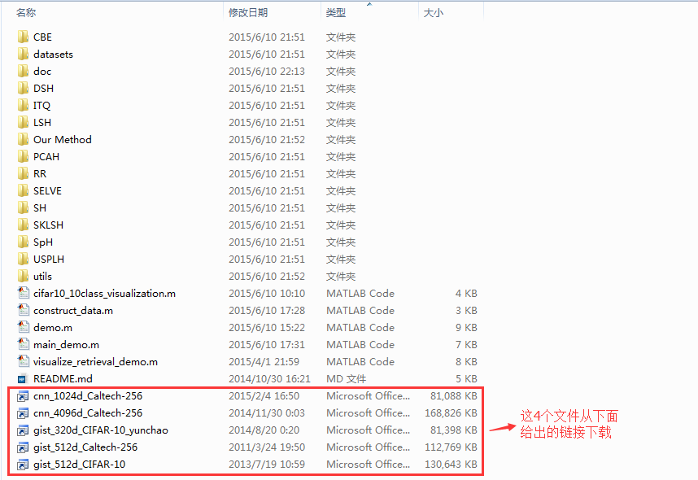
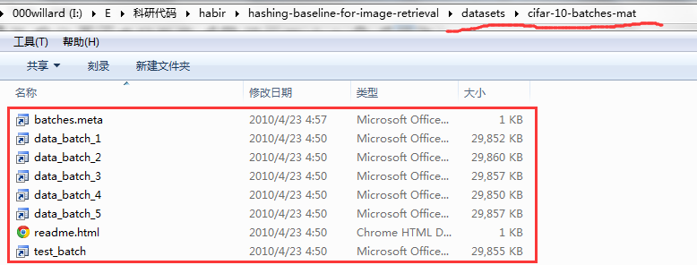
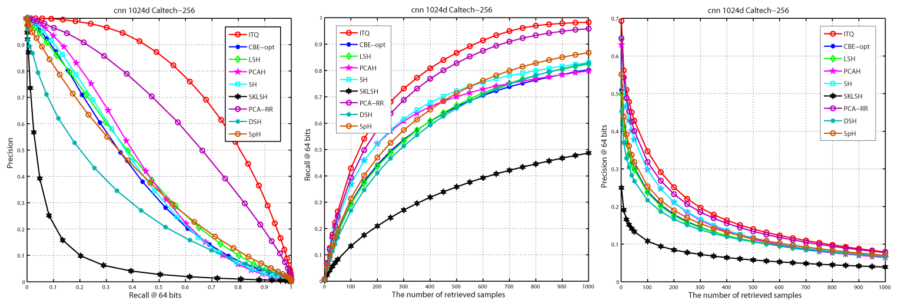
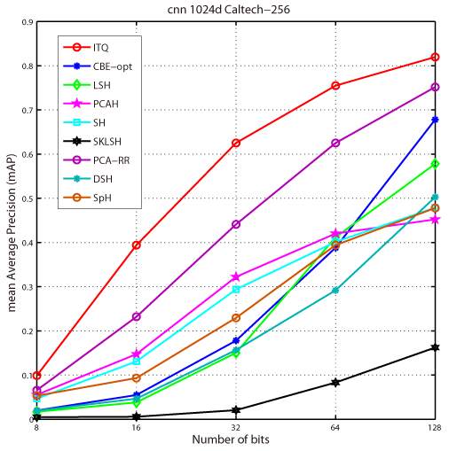
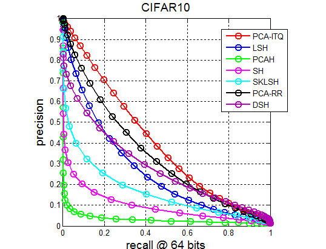
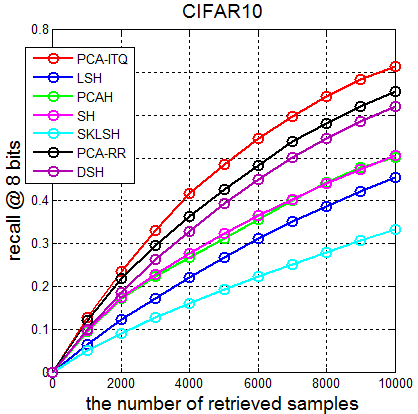
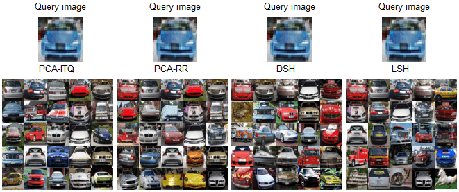
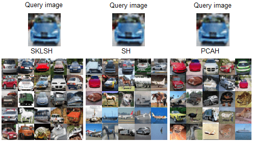

###HABIR哈希图像检索工具箱是什么？
HABIR哈希图像检索工具箱是一个用Matlab语言写的集成了经典哈希方法以及最近几年无监督哈希方法的基准框架，里面包含了针对图像检索的主流评价指标，使用该工具箱使得你可以专注于哈希方法的设计，其他性能评价这些方面的东西可以由它来帮你完成。

###为什么会有HABIR哈希图像检索工具箱？
目前我主要致力于大规模图像检索研究，在图像检索中除了专注与duplicate search外我也花很大力气在哈希大规模图像检索上。在研究的过程中，我发觉几乎很少有研究者提供不同对比方法的代码。这为研究带来了很大不便，而且我坚信在研究的过程中，我们应专注于新算法的设计，而不是新人进来时都得重新造轮子，我们可以在现有代码的基础上学习它，并将它进行拓展，为自己使用。于是，就有了你现在看到的这个[hashing-baseline-for-image-retrieval](https://github.com/willard-yuan/hashing-baseline-for-image-retrieval)，希望它能够为关注基于哈希方法进行图像检索的小伙伴们带去些许帮助。如果想深入了解哈希的话，这里总结的一篇博文对你非常的有帮助：[**Hashing图像检索源码及数据库总结**](http://yongyuan.name/blog/codes-of-hash-for-image-retrieval.html)

###怎样使用HABIR哈希图像检索工具箱？
1. 下载数据库。在本地计算机上，HABIR的文件目录结构如下图所示：

图1 工具包目录

图2 CIFAR-10图像数据库目录

可以看到这四个特征文件比较大，这4个文件可以到下面给出的链接中下载，下载完请按图1目录放置。

cnn\_1024d\_Caltech-256下载地址：[cnn_1024d_Caltech-256.mat](http://pan.baidu.com/s/1o67k5RG) 
gist\_512d\_Caltech-256下载地址：[gist_512d_Caltech-256.mat](http://pan.baidu.com/s/1jG8ECZW) 
cnn\_4096d\_Caltech-256下载地址：[cnn_4096d_Caltech-256.mat](http://pan.baidu.com/s/1eQIWkro) 
gist\_320d\_CIFAR-10\_yunchao下载地址：[gist_320d_CIFAR-10_yunchao.mat](http://pan.baidu.com/s/1o61KSQI) 

另外一个比较大的文件是[CIFAR-10](http://www.cs.toronto.edu/~kriz/cifar.html)数据库，这个图像数据库请到官网下载对应的Matlab版，解压后按图2放置。

**Note**:对于CNN特征的提取，可以使用我写的一个采用VGG训练已模型提取CNN特征的代码，[CNN-for-Image-Retrieval](https://github.com/willard-yuan/CNN-for-Image-Retrieval)。

2.运行脚本。该工具箱有三个可执行的脚本，各脚本对应功能如下：

- main_demo.m: 主要脚本文件，This is the main script ufor evaluate the performance,  and you can get Precision-Recall curve, mean Average Precision (mAP) curves,  Recall-The number of retrieved samples curve, Precision-The number of retrieved samples curve.(偷点懒，把脚本中我写的英文注释拿过来)
- visualize\_retrieval_demo.m：检索可视化脚本文件，主要用来对不同的查询结果进行检索可视化（**该脚本还在整理中**）。
- cifar10_10class\_visualization.m：可视化CIFAR-10数据库上的图像，官网上CIFAR-10数据库提供的是保存为像素值的mat文件，用该脚本你可以对该数据库上的图像进行可视化。

###收录进HABIR哈希图像检索工具箱的哈希方法
- **PCA-ITQ**,**PCA-RR**: Iterative Quantization. 作者建立的项目详细信息请移步这里：[ITQ](http://www.unc.edu/~yunchao/itq.htm)。
>Yunchao Gong and Svetlana Lazebnik.  Iterative Quantization: A Procrustean Approach to Learning Binary Codes. In: IEEE International Conference on Computer Vision and Pattern Recognition (CVPR), 2011.

- **SH**: Spectral Hashing. 作者建立的项目详细信息请移步这里：[SH](http://www.cs.huji.ac.il/~yweiss/SpectralHashing/)。
>Y. Weiss, A. Torralba, R. Fergus. Advances in Neural Information Processing Systems, 2008.

- **SpH**: Spherical Hashing. 作者建立的项目详细信息请移步这里：[SpH](http://sglab.kaist.ac.kr/Spherical_Hashing/)。
>Jae-Pil Heo, Youngwoon Lee, Junfeng He, Shih-Fu Chang, and Sung-eui Yoon. Spherical Hashing. CVPR, 2012.

- **LSH**: Local Sensentive Hashing，经典方法。
- **SKLSH**: Maxim Raginsky and Svetlana Lazebnik. 
>Locality-sensitive binary codes from shift-invariant kernels. Advances in Neural Information Processing 22, pp. 1509-1517, 2009.

- **PCAH**: PCA Hashing.
- **DSH**: Density Sensitive Hashing. 项目主页请移步这里：[DSH](http://www.cad.zju.edu.cn/home/dengcai/Data/DSH.html).
>Z. Jin, C. Li, Y. Lin and D. Cai, "Density sensitive hashing," IEEE Transactions on Cybernetics, 44(8), pp. 1362-1371.

- **CBE**: Circulant Binary Embedding.
>X. Yu, S. Kumar, Y. Gong, S.F. Chang. Circulant Binary Embedding. In Proceedings of the International Conference on Machine Learning (ICML), 2014.

- **SELVE**: Sparse Embedding and Least Variance Encoding
>X. Zhu, L. Zhang and Z. Huang, "A Sparse Embedding and Least Variance Encoding Approach to Hashing," IEEE Transactions on Image Processing, 2014.

**Note**:如果你要将SELVE加入对比中的话，请保持你的Matlab版本在2012及其以下，**非常重要**。

###V2.0版本结果演示
V2.0版本演示结果如下，左边为Precision-Recall曲线，中间为Recall-The number of retrieved samples曲线，右边为Precision-The number of retrieved samples曲线：

图3: 128位编码

图4: 64位编码

图5：32位编码

图6：16位编码

图7：8位编码

图8：不同编码位下mAP曲线(run times = 1)

**Tips**：为了对图片进行润色，推荐你用Adobe Illustrator对其进行处理使得其更加美观。

###V1.x版本结果演示
V1.x版本演示结果如下，在64位编码下，查准率与召回率曲线如下：

在8位编码下，召回率随返回样本数曲线如下：

平均检索精度MAP随bits长度的变化

检索实例

###运行环境

- Matlab

###版本更新
-  V2.0   2015/06/10
    - 相比于1.x版，该版本做了较大的更新，添加了新的评价指标，基本涵盖了论文中常用的上面提到的4种指标。
	- 对框架做了一些调整，并添加了2014年相关论文的方法。
-  V1.4   2014/09/22
    - 修复画MAP曲线的错误，重新以Gong Yunchao所用的计算曲线面积的方法画MAP曲线
	- 将原来画曲线时只运行一次改为运行多次（10次，程序中可以自己修改设定），对10次的MAP取平均，之所以这样做是因为不同的方法中用到了随机函数，通过运行多次减少每次运行结果的差异
-  V1.3   2014/08/21
	- 完成MAP随bits长度的曲线，添加进来SpH和DSH。
	- 完善绘制的图，使画出的图更美观。
	- 优化框架结构，使布局更有层次。
-  V1.2   成型版本: 2014/08/16---2014/08/19
-  V1.1   初始版本: 2013/09/26
-  V1.0   原型版本: 2013/07/22

###加入进来

如果你觉得这个对你有用，想加入进来的话，可以先clone过去，然后再Pull Requests.
