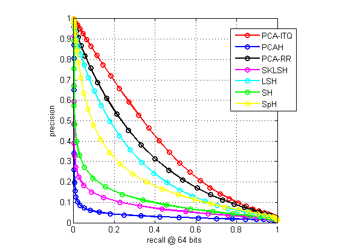

### 为什么会有hashing-baseline-for-image-retrieval

这是我的[**个人主页**](http://willard-yuan.github.io/)，正如你所看到的，目前我主要研究基于哈希方法的大规模图像检索。

在研究的过程中，抛开各种论文里的baseline对比方法，我发觉几乎没有人提供不同的对比方法的代码。这为研究带来了很大的不便，我坚信在研究的过程中，我们应该专注于新方法的设计，而不是对于每个新进来的人都得重新造轮子。

正是抱着这样一种信念，就有了这个[**hashing-baseline-for-image-retrieval**](https://github.com/willard-yuan/hashing-baseline-for-image-retrieval)，希望这个项目能够为那些关注基于哈希图像检索的小伙伴们带去些许帮助。

### To do list

- 完善文档
- 绘制MAP vs. bits曲线，recall vs. the number of top retrieved samples曲线
- 再添加一个数据库

### 结果演示

If there is a bug, don't hesitate to contact me. Thanks!
