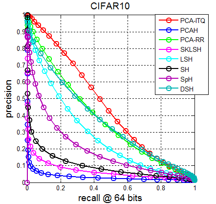
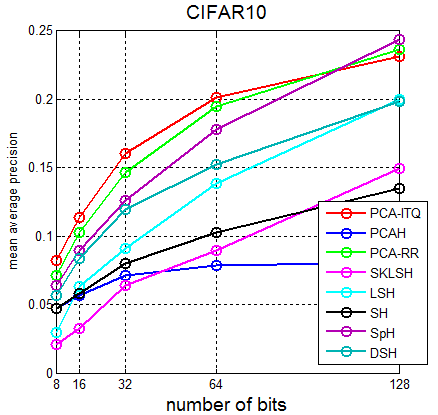
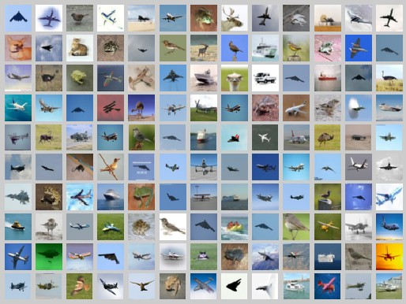

### **为什么会有hashing-baseline-for-image-retrieval**

这是我的[**个人主页**](http://willard-yuan.github.io/)，正如你所看到的，目前我主要研究基于哈希方法的大规模图像检索。

在研究的过程中，抛开各种论文里的baseline对比方法，我发觉几乎没有人提供不同的对比方法的代码。这为研究带来了很大的不便，我坚信在研究的过程中，我们应该专注于新方法的设计，而不是每个新人进来时都得重新造轮子。

于是，就有了这个[**hashing-baseline-for-image-retrieval**](https://github.com/willard-yuan/hashing-baseline-for-image-retrieval)，希望它能够为那些关注基于哈希方法进行图像检索的小伙伴们带去些许帮助。

### 已经入选的哈希方法

注意：**截止此刻，所有入选进行的哈希方法都是无监督的**。

- **PCA-ITQ**、**PCA-RR**: Iterative Quantization. 作者建立的项目详细信息请移步这里：[ITQ](http://www.unc.edu/~yunchao/itq.htm)。Yunchao Gong and Svetlana Lazebnik.  Iterative Quantization: A Procrustean Approach to Learning Binary Codes. In: IEEE International Conference on Computer Vision and Pattern Recognition (CVPR), 2011.
- **SH**: Spectral Hashing. 作者建立的项目详细信息请移步这里：[SH](http://www.cs.huji.ac.il/~yweiss/SpectralHashing/)。Y. Weiss, A. Torralba, R. Fergus. Advances in Neural Information Processing Systems, 2008.
- **SpH**: Spherical Hashing. 作者建立的项目详细信息请移步这里：[SpH](http://sglab.kaist.ac.kr/Spherical_Hashing/)。Jae-Pil Heo, Youngwoon Lee, Junfeng He, Shih-Fu Chang, and Sung-eui Yoon. Spherical Hashing. CVPR, 2012.
- **LSH**: Local Sensentive Hashing. Implemented by me.
- **SKLSH**: Maxim Raginsky and Svetlana Lazebnik. Locality-sensitive binary codes from shift-invariant kernels. Advances in Neural Information Processing 22, pp. 1509-1517, 2009
- **PCAH**: PCA Hashing. Implemented by me.
- **DSH**: Density Sensitive Hashing. 项目主页请移步这里：[DSH](http://www.cad.zju.edu.cn/home/dengcai/Data/DSH.html).

### **待做事项**

- 完善文档
- 绘制recall vs. the number of top retrieved samples曲线
- 再添加一个数据库

### **结果演示**

在64位编码下，查准率与召回率曲线如下：

平均检索精度MAP随bits长度的变化

检索实例

### **加入进来**

如果你觉得这个对你有用，想加入进来的话，可以先clone过去，然后再Pull Requests。

### **版本更新**
-  V1.3   2014/08/21
	1. 完成MAP随bits长度的曲线，添加进来SpH和DSH
	2. 完善绘制的图，使画出的图更美观
	3. 优化框架结构，使布局更有层次
-  V1.2   modified date: 2014/08/16---2014/08/19
-  V1.1   Last modified date: 2013/09/26
-  V1.0   Initial date: 2013/07/22
