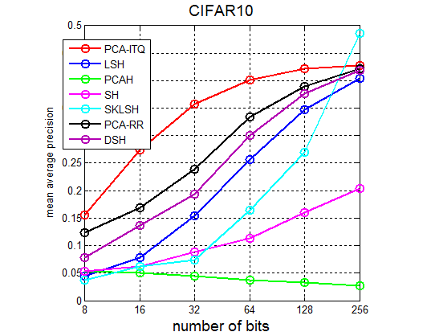
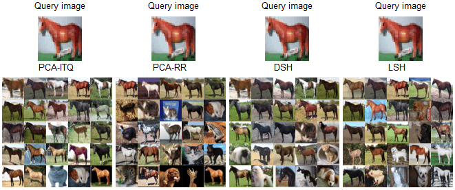
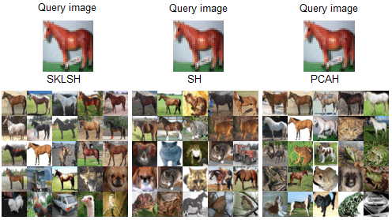

## 缘起 ##

这是我的[个人主页](http://yongyuan.name/)，正如你所看到的，目前我主要致力于基于哈希方法的大规模图像检索。在研究的过程中，我发觉几乎很少有研究者提供不同对比方法的代码。这为研究带来了很大不便，而且我坚信在研究的过程中，我们应专注于新算法的设计，而不是新人进来时都得重新造轮子，我们可以在现有代码的基础上学习它，并将它进行拓展，为自己使用。

于是，就有了你现在看到的这个[hashing-baseline-for-image-retrieval](https://github.com/willard-yuan/hashing-baseline-for-image-retrieval)，希望它能够为关注基于哈希方法进行图像检索的小伙伴们带去些许帮助。

## 哈希方法 ##

- **PCA-ITQ**,**PCA-RR**: Iterative Quantization. 作者建立的项目详细信息请移步这里：[ITQ](http://www.unc.edu/~yunchao/itq.htm)。

	>Yunchao Gong and Svetlana Lazebnik.  Iterative Quantization: A Procrustean Approach to Learning Binary Codes. In: IEEE International Conference on Computer Vision and Pattern Recognition (CVPR), 2011.

- **SH**: Spectral Hashing. 作者建立的项目详细信息请移步这里：[SH](http://www.cs.huji.ac.il/~yweiss/SpectralHashing/)。

	>Y. Weiss, A. Torralba, R. Fergus. Advances in Neural Information Processing Systems, 2008.

- **SpH**: Spherical Hashing. 作者建立的项目详细信息请移步这里：[SpH](http://sglab.kaist.ac.kr/Spherical_Hashing/)。

	>Jae-Pil Heo, Youngwoon Lee, Junfeng He, Shih-Fu Chang, and Sung-eui Yoon. Spherical Hashing. CVPR, 2012.

- **LSH**: Local Sensentive Hashing. Implemented by me.
- **SKLSH**: Maxim Raginsky and Svetlana Lazebnik. 

	>Locality-sensitive binary codes from shift-invariant kernels. Advances in Neural Information Processing 22, pp. 1509-1517, 2009.

- **PCAH**: PCA Hashing. Implemented by me.
- **DSH**: Density Sensitive Hashing. 项目主页请移步这里：[DSH](http://www.cad.zju.edu.cn/home/dengcai/Data/DSH.html).

注意：截止此刻，所有入选进行的哈希方法都是无监督的

## 数据库说明 ##

数据库`cifar_10yunchao.mat`是来自[Yunchao Gong](http://www.unc.edu/~yunchao/)在[CIFAR10](http://www.cs.toronto.edu/~kriz/cifar.html)提取的320维GIST特征，第321维是图像的类别标签

## 待做事项 ##

- 完善文档
- 绘制recall vs. the number of top retrieved samples曲线
- 再添加一个数据库

## 运行环境 ##

- 64位系统（主要是图像数据库比较大，Windows或Linux都可以）
- 16g内存（我电脑是16g的，8g的应该也行）

## 版本更新 ##
-  V1.4   2014/09/22
    - 修复画MAP曲线的错误，重新以Gong Yunchao所用的计算曲线面积的方法画MAP曲线
	- 将原来画曲线时只运行一次改为运行多次（10次，程序中可以自己修改设定），对10次的MAP取平均，之所以这样做是因为不同的方法中用到了随机函数，通过运行多次减少每次运行结果的差异
-  V1.3   2014/08/21
	- 完成MAP随bits长度的曲线，添加进来SpH和DSH
	- 完善绘制的图，使画出的图更美观
	- 优化框架结构，使布局更有层次
-  V1.2   成型版本: 2014/08/16---2014/08/19
-  V1.1   初始版本: 2013/09/26
-  V1.0   原型版本: 2013/07/22

## 结果演示 ##

在64位编码下，查准率与召回率曲线如下：

平均检索精度MAP随bits长度的变化

检索实例

## 加入进来 ##

如果你觉得这个对你有用，想加入进来的话，可以先clone过去，然后再Pull Requests.
